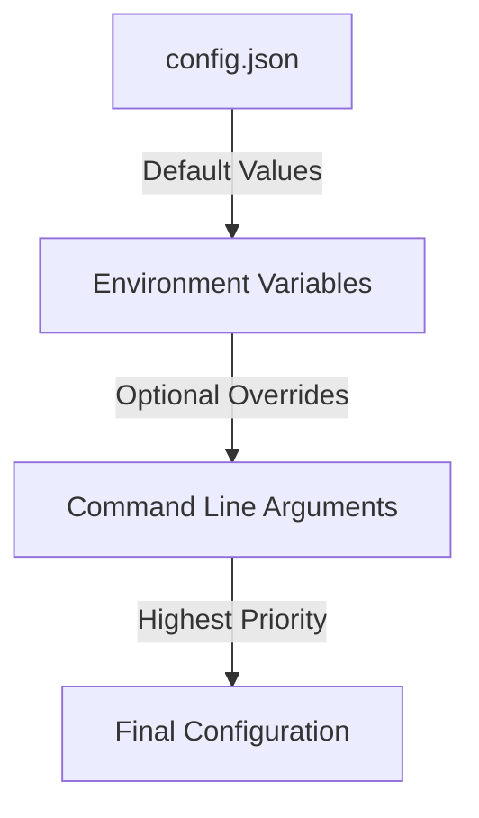

# IRC Chatbot

A Python-based IRC chatbot that uses Ollama for generating responses. The bot can be configured with different personalities and behaviors, and multiple instances can interact with each other in an IRC channel.

## Features

- Connects to IRC servers and joins specified channels
- Uses Ollama for AI-powered responses
- Configurable personality and behavior
- Multiple response styles and tones
- Conversation history tracking
- Logging support
- Environment variable configuration
- Anti-repetition and anti-looping mechanisms
- Command-line configuration for running multiple bots
- Includes Docker setup for local IRC server

## Requirements

- Python 3.6+
- IRC server (included Docker setup available)
- Ollama server running locally or remotely

## Installation

1. Clone the repository:
```bash
git clone https://github.com/nrdgrrrl/IRC-Chatbot.git
cd IRC-Chatbot
```

2. Install dependencies:
```bash
pip install -r requirements.txt
```

3. (Optional) Set up a local IRC server using Docker:
```bash
cd ircserver-docker
docker-compose up -d
```
See [IRC Server Setup](ircserver-docker/README.md) for more details.

4. Configure the bot by editing `config.json` or setting environment variables.

## Configuration

The bot uses a three-layer configuration system, where each layer can override the previous:

1. Default values in `config.json` (base configuration)
2. Environment variables (optional overrides)
3. Command-line arguments (highest priority)

### Configuration Hierarchy



### 1. Base Configuration (`config.json`)

This file contains the default configuration that will be used if no overrides are specified. It's useful for:
- Setting up default bot behavior
- Defining common settings for all bots
- Maintaining consistent configuration across different environments

```json
{
    "irc": {
        "server": "irc.example.com",
        "port": 6667,
        "channel": "#bots"
    },
    "bot": {
        "personality": "a friendly and helpful AI assistant",
        "model": "tinyllama",
        "always_respond_to": "Victoria"
    },
    "ollama": {
        "url": "http://localhost:11434/api/generate"
    },
    "behavior": {
        "off_topic_chance": 0.12,
        "tone_chance": 0.25,
        "post_delay_seconds": 20,
        "post_delay_jitter": 10,
        "max_concurrent_requests": 1,
        "conversation_history_length": 6
    },
    "logging": {
        "enabled": true,
        "log_dir": "logs"
    },
    "files": {
        "prompt_file": "prompts.json"
    }
}
```

Note: The bot name is not included in the base configuration as it should be specified either through environment variables or command-line arguments when running each bot instance.

### 2. Environment Variables

Environment variables can override the default values from `config.json`. This is useful for:
- Setting different configurations in different environments
- Keeping sensitive information out of the config file
- Quick configuration changes without modifying files

```bash
# IRC Configuration
IRC_SERVER=irc.example.com
IRC_PORT=6667
IRC_CHANNEL=#bots

# Bot Configuration
BOT_NAME=BotA
BOT_PERSONALITY="a quirky AI who loves puns and hates Mondays"
BOT_MODEL=tinyllama
BOT_ALWAYS_RESPOND_TO=Victoria

# Ollama Configuration
OLLAMA_URL=http://localhost:11434/api/generate
```

### 3. Command-line Arguments

Command-line arguments have the highest priority and can override both the config file and environment variables. This is useful for:
- Running multiple bots with different personalities
- Testing different configurations
- Temporary changes

```bash
python bot.py --bot-name BotB --personality "a sarcastic AI who loves dad jokes"
```

Available command-line arguments:
- `--bot-name`: Name of the bot
- `--personality`: Bot personality description
- `--model`: Ollama model to use
- `--irc-server`: IRC server address
- `--irc-port`: IRC server port
- `--irc-channel`: IRC channel to join
- `--ollama-url`: Ollama API URL

### When to Use Each Method

1. **Use `config.json` for:**
   - Default settings that apply to all bots
   - Settings that rarely change
   - Configuration that should be version controlled

2. **Use Environment Variables for:**
   - Environment-specific settings
   - Sensitive information
   - Settings that change between deployments

3. **Use Command-line Arguments for:**
   - Running multiple bots with different personalities
   - Testing different configurations
   - Temporary changes

### Example: Running Multiple Bots with Different Configurations

1. **Basic Bot** (uses `config.json` defaults):
```bash
python bot.py
```

2. **Custom Bot** (overrides with command-line arguments):
```bash
python bot.py --bot-name BotB --personality "a sarcastic AI who loves dad jokes"
```

3. **Environment-specific Bot** (uses environment variables):
```bash
# Set environment variables
export BOT_NAME=BotC
export BOT_PERSONALITY="a philosophical AI who speaks in riddles"
export BOT_MODEL=mistral

# Run bot
python bot.py
```

## Running Multiple Bots

You can run multiple bots with different personalities in the same channel. Here are some examples:

### Example 1: Basic Bot Setup
```bash
# Terminal 1 - Default bot
python bot.py

# Terminal 2 - Sarcastic bot
python bot.py --bot-name BotB --personality "a sarcastic AI who loves dad jokes"

# Terminal 3 - Philosophical bot
python bot.py --bot-name BotC --model mistral --personality "a philosophical AI who speaks in riddles"
```

### Example 2: Themed Bot Group
```bash
# Terminal 1 - Tech Support Bot
python bot.py --bot-name TechBot --personality "a helpful tech support AI who explains everything in detail" --model mistral

# Terminal 2 - Meme Bot
python bot.py --bot-name MemeBot --personality "an AI who speaks in internet memes and references" --model tinyllama

# Terminal 3 - Poetry Bot
python bot.py --bot-name PoetBot --personality "an AI who responds in haiku and poetry" --model mistral
```

### Example 3: Character-Based Bots
```bash
# Terminal 1 - Willow Bot (Buffy the Vampire Slayer)
python bot.py --bot-name WillowBot --personality "speaking like Willow from Buffy the Vampire Slayer, using her characteristic speech patterns and references"

# Terminal 2 - Robot Bot
python bot.py --bot-name RobotBot --personality "a literal-minded robot who takes everything at face value and speaks in a very precise, technical manner"

# Terminal 3 - Gossip Bot
python bot.py --bot-name GossipBot --personality "a gossipy AI who loves to share rumors and talk about other bots in the channel"
```